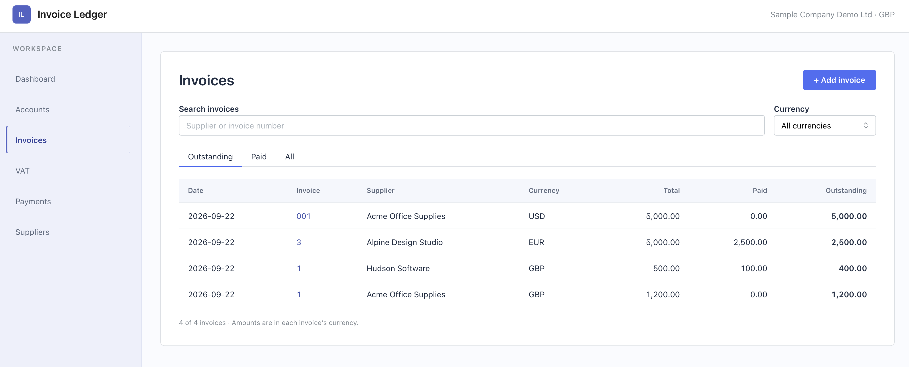

# Invoice Ledger

A focused accounting application for recording multi-currency supplier invoices, settling them in full or in part, and seeing the journals behind every transaction.


*Outstanding balance for each invoice*




## Features

- Record GBP, EUR, and USD supplier invoices with VAT.
- Record full and partial payments from a GBP bank account.
- Track outstanding balances in invoice currency and GBP carrying value.
- Preserve the FX rate used for each invoice and payment.
- Calculate realised FX gains and losses when foreign invoices are settled.
- Inspect linked journals, account ledgers, input VAT, P&L, and trial balance reports.
- Use the same accounting services through the web application and CLI.
- Persist data in PostgreSQL across restarts and browsers.

See [accounting conventions](docs/conventions.md) for the demo’s VAT, currency, and posting assumptions.

## Tech stack

- **Backend:** Python 3.12, FastAPI, SQLAlchemy, Pydantic, Typer, PostgreSQL
- **Frontend:** React, TypeScript, Vite, Mantine UI
- **Tooling:** uv, npm, Docker Compose

## Local setup

Install [Docker Desktop](https://www.docker.com/products/docker-desktop/), [uv](https://docs.astral.sh/uv/), Python 3.12+, and Node.js.

Create the local database configuration:

```bash
cp backend/.env.example backend/.env
```

Choose a password in `backend/.env` and use the same value in `POSTGRES_PASSWORD` and `DATABASE_URL`. The file is ignored by Git.

Build the frontend:

```bash
cd frontend
npm install
npm run build
```

Start PostgreSQL and the application:

```bash
cd ../backend
uv sync
docker compose up -d --wait db
uv run ledger web
```

Open [http://127.0.0.1:8888](http://127.0.0.1:8888). Web startup creates missing tables and adds the demo reference data once without resetting existing records.

The CLI uses the same database and accounting services:

```bash
uv run ledger --help
```

To stop PostgreSQL without deleting its data:

```bash
docker compose stop db
```

## Project structure

```text
backend/
  app/              FastAPI app, CLI, models, schemas, and accounting services
  tests/            Backend and accounting behaviour tests
  compose.yaml      Local PostgreSQL service
frontend/           React and TypeScript source
docs/               Accounting conventions and demo media
Dockerfile          Production image for Railway
```

Frontend builds are written to `backend/app/static/` and are intentionally ignored by Git.
